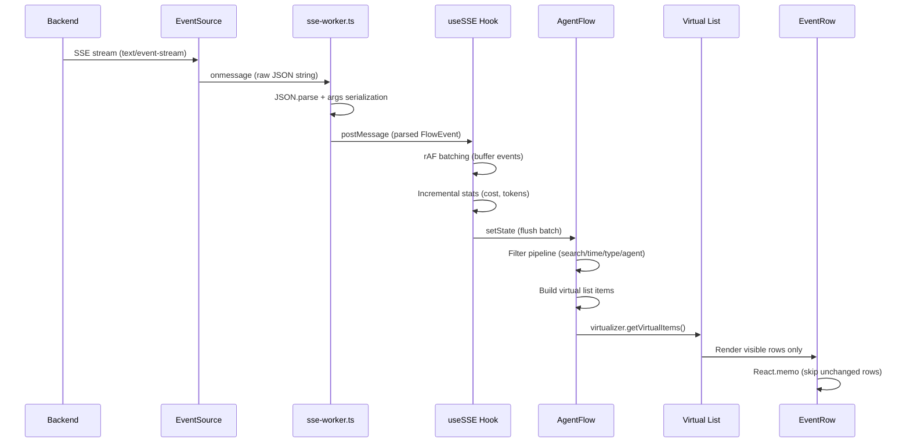
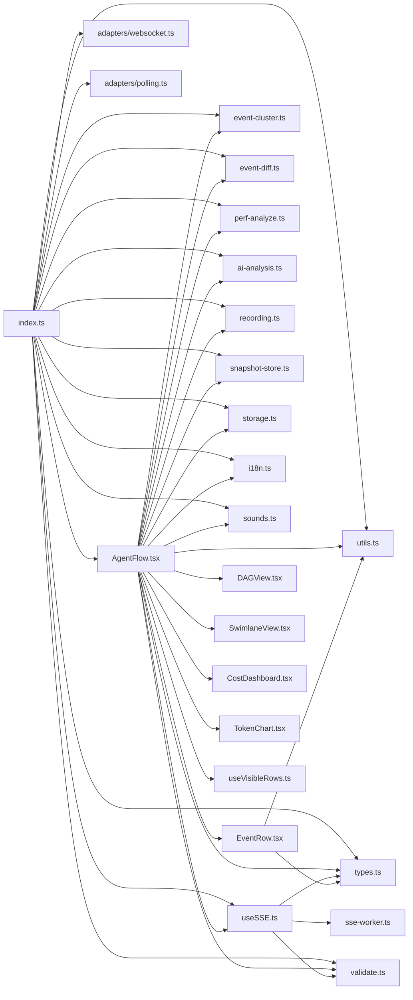
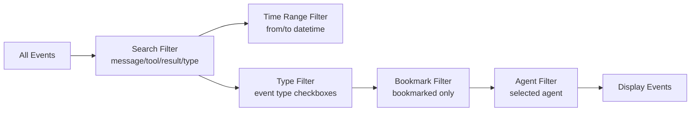
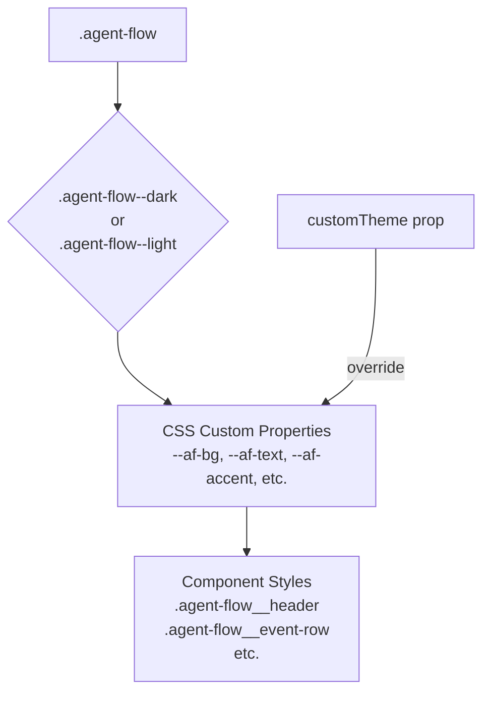

# Architecture

This document describes the internal architecture of agent-sse-flow.

## System Overview

```mermaid
graph TB
    subgraph "Backend"
        SSE[SSE Endpoint]
    end

    subgraph "Transport Layer"
        ES[EventSource]
        WS[WebSocket Adapter]
        POLL[HTTP Polling Adapter]
    end

    subgraph "Processing Layer"
        WORKER[sse-worker.ts<br/>Web Worker]
        USESSE[useSSE Hook<br/>rAF Batching + Stats]
    end

    subgraph "State Layer"
        STATE[AgentFlow.tsx<br/>30+ useState hooks]
        FILTER[Filtering Pipeline<br/>search → time → type → agent]
    end

    subgraph "Rendering Layer"
        VIRT[@tanstack/react-virtual<br/>Virtual Scrolling]
        IO[useVisibleRows<br/>IntersectionObserver]
    end

    subgraph "View Components"
        ER[EventRow / TimelineRow]
        WV[WaterfallBar]
        DAG[DAGView]
        SL[SwimlaneView]
        CC[CostDashboard]
        TC[TokenChart]
    end

    subgraph "Supporting Modules"
        VAL[validate.ts]
        CLUSTER[event-cluster.ts]
        DIFF[event-diff.ts]
        PERF[perf-analyze.ts]
        AI[ai-analysis.ts]
        REC[recording.ts]
        SNAP[snapshot-store.ts]
        STORE[storage.ts]
        I18N[i18n.ts]
        SND[sounds.ts]
    end

    SSE --> ES
    SSE --> WS
    SSE --> POLL
    ES --> WORKER
    WS --> WORKER
    POLL --> WORKER
    WORKER -->|postMessage| USESSE
    USESSE --> STATE
    STATE --> FILTER
    FILTER --> VIRT
    VIRT --> IO
    IO --> ER
    IO --> WV
    STATE --> DAG
    STATE --> SL
    STATE --> CC
    STATE --> TC

    VAL -.->|validate events| USESSE
    CLUSTER -.->|cluster view| STATE
    DIFF -.->|diff modal| STATE
    PERF -.->|perf panel| STATE
    AI -.->|analyze panel| STATE
    REC -.->|record stream| STATE
    SNAP -.->|save/load| STATE
    STORE -.->|persist| STATE
    I18N -.->|translations| STATE
    SND -.->|audio feedback| STATE
```

## Data Flow



## Component Hierarchy

```mermaid
graph TD
    AF[AgentFlow] --> HEADER[Header Toolbar]
    AF --> FILTERS[Filter Bar]
    AF --> STATS[Stats Panel]
    AF --> SEARCH[Search Bar]
    AF --> VL[Virtual List]

    HEADER --> THEME[Theme Toggle]
    HEADER --> VIEW[View Mode Selector]
    HEADER --> EXPORT[Export Button]
    HEADER --> CLEAR[Clear Button]
    HEADER --> COMPACT[Compact Toggle]
    HEADER --> HELP[Help Button]
    HEADER --> RECORD[Record Button]

    VL --> ER[EventRow]
    VL --> TR[TimelineRow]
    VL --> WV[WaterfallBar]
    VL --> GH[Group Header]
    VL --> SEP[Separator]

    AF --> DAG[DAGView]
    AF --> SL[SwimlaneView]
    AF --> CC[CostDashboard]
    AF --> TC[TokenChart]

    AF --> MODAL[Detail Modal]
    AF --> CTX[Context Menu]
    AF --> BREAK[Breakpoint Panel]
    AF --> SNAP[Snapshot Panel]
    AF --> DIFF[Diff Modal]
    AF --> AI[Analysis Panel]
    AF --> PERF[Performance Panel]

    ER --> SYNTAX[SyntaxHighlight]
    ER --> AVATAR[AgentAvatar]
    ER --> DUR[DurationBar]
```



## Module Dependency Graph



## Filtering Pipeline

Events are filtered through a sequential pipeline:



## Virtual Scrolling Strategy

```mermaid
graph TD
    EVENTS[Filtered Events] --> ITEMS[Build Virtual List Items<br/>events + group headers + separators]
    ITEMS --> VIRTUALIZER[@tanstack/react-virtual<br/>estimateSize: 80px]
    VIRTUALIZER --> VISIBLE[getVirtualItems()<br/>only visible rows]
    VISIBLE --> ROWS[Render Rows]
    ROWS --> IO{IntersectionObserver<br/>entered viewport?}
    IO -->|Yes| FULL[Full EventRow<br/>with all content]
    IO -->|No| PLACEHOLDER[Placeholder div<br/>height only]
```

## State Management

AgentFlow.tsx manages all UI state via React hooks:

```mermaid
graph TD
    subgraph "Connection State"
        STATUS[status: EventStatus]
        CONN_DETAILS[connectionDetails]
    end

    subgraph "Event State"
        EVENTS[events: FlowEvent[]]
        FILTERED[filteredEvents: FlowEvent[]]
        STATS[stats: SSEStats]
    end

    subgraph "UI State"
        THEME[theme: Theme]
        VIEW[viewMode: ViewMode]
        COMPACT[compact: boolean]
        SEARCH[searchQuery: string]
        TIME_FROM[timeFrom: string]
        TIME_TO[timeTo: string]
        ENABLED_TYPES[enabledTypes: Set]
        SELECTED[selectedAgent: string]
    end

    subgraph "Interaction State"
        COLLAPSED[collapsedIds: Set]
        BOOKMARKS[bookmarkedIds: Set]
        PINNED[pinnedIds: Set]
        EXPANDED[expandedArgsIds: Set]
        HIGHLIGHTED[highlightedId: number]
    end

    subgraph "Panel State"
        SHOW_SEARCH[showSearch: boolean]
        SHOW_STATS[showStats: boolean]
        SHOW_HELP[showHelp: boolean]
        SHOW_PERF[showPerf: boolean]
        MODAL[modalEvent: FlowEvent]
        CTX[contextMenu: position + event]
    end
```

## CSS Architecture

The styling uses BEM naming with CSS custom properties for theming:



### CSS Performance Strategy

1. **Containment**: `contain: content` on event rows
2. **Content-visibility**: `content-visibility: auto` for off-screen rows
3. **Will-change**: `will-change: transform` on animated elements
4. **GPU acceleration**: Animations use `transform` and `opacity` only
